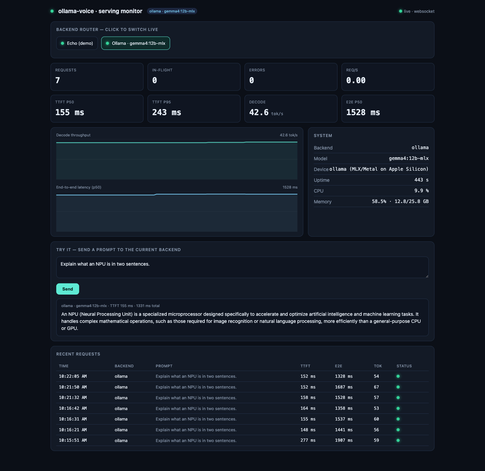

# Ollama Voice


A fully local, private voice assistant — bidirectional Speech-to-Speech powered by Ollama, Whisper, and TTS. No cloud APIs, no subscriptions, no data leaving your machine. Supports GPU acceleration when available.

## Serving Monitor

Beyond the voice loop, the project ships an OpenAI-compatible serving layer with a live monitoring dashboard. It wraps a multi-backend router (Echo demo + Ollama) behind an HTTP API and streams inference telemetry — TTFT, decode throughput, end-to-end latency, and system stats — over a websocket.



```bash
# Launch the dashboard + OpenAI endpoint with the Ollama backend
python serve.py --backends echo,ollama --ollama-model gemma4:12b-mlx --port 8000
```

Then open <http://127.0.0.1:8000> to switch the active backend live and send prompts from the browser, or point any OpenAI client (including the voice agent) at `http://127.0.0.1:8000/v1`.

### Voice chat

The dashboard includes a push-to-talk voice chat: press the mic button, speak, and press again to send. Speech processing stays fully local on the server — the browser uploads your recording to `POST /v1/audio/transcriptions` (faster-whisper STT, loaded lazily on first use; size via `--whisper-model`), the reply streams through the metered `/v1/chat/completions` path, and `POST /v1/audio/speech` synthesizes a WAV (macOS `say`, or `pyttsx3` elsewhere) that plays back in the tab, along with a per-turn latency breakdown (STT · TTFT · LLM · TTS).

```bash
pip install -r requirements-serve.txt   # includes faster-whisper for voice chat
```

## Features

- 🎤 **Speech-to-Text**: Uses `faster-whisper` for accurate, local speech recognition with VAD-based silence detection
- 🤖 **LLM Processing**: Integrates with Ollama — swap in any local model (Llama, Qwen, Gemma, DeepSeek, ...) — or a [Furiosa LLM](https://developer.furiosa.ai/v2026.3.0/en/get_started/furiosa_llm.html) server for RNGD NPU inference
- 🔊 **Text-to-Speech**: Uses system voices via `pyttsx3` for offline speech synthesis
- ⚡ **GPU Accelerated**: Leverages GPU acceleration when available
- 🔒 **Fully Local & Private**: All processing happens on-device — ideal for privacy-first, local-first AI setups
- 🎯 **Hands-free Conversation**: Continuous listening with adaptive silence detection and echo prevention for natural back-and-forth

## Prerequisites

1. **Operating System**: Linux, Windows, or macOS
2. **Python 3.8+**
3. **Ollama** installed and running
   ```bash
   # Download from https://ollama.com
   # Or use your system's package manager (brew, apt, pacman, ...)
   ```

4. **Ollama Model** - Pull a model (e.g., llama3.2):
   ```bash
   ollama pull llama3.2
   ```

## Quick Start

```bash
git clone <repository-url>
cd ollama-voice

# Check prerequisites (Python, Ollama install, Ollama server + models)
./setup.sh

# Create a virtual environment, install dependencies, and launch
./run.sh
```

## Manual Installation

1. Install Python dependencies:
   ```bash
   pip install -r requirements.txt
   ```

2. Ensure Ollama is running:
   ```bash
   ollama serve
   ```

3. Run the service:
   ```bash
   python main.py
   ```

### Command-line Options

```bash
python main.py --help
```

Options:
- `--backend`: LLM backend - `ollama` or `furiosa` (default: `ollama`)
- `--model`: Model to use (default: `llama3.2` for ollama, `EMPTY` for furiosa)
- `--llm-url`: Base URL of the Furiosa LLM server, used with `--backend furiosa` (default: `http://localhost:8000/v1`)
- `--whisper-model`: Whisper model size - `tiny`, `base`, `small`, `medium`, `large-v2` (default: `base`)
- `--sample-rate`: Audio sample rate in Hz (default: `16000`)
- `--silence-duration`: Seconds of silence before ending a recording (default: `1.5`)
- `--max-duration`: Maximum recording duration in seconds (default: none, uses silence detection)

### Examples

```bash
# Use a different Ollama model
python main.py --model qwen3

# Use a larger Whisper model for better accuracy
python main.py --whisper-model medium

# Fixed-length recording instead of silence detection
python main.py --max-duration 5

# Use a Furiosa LLM server instead of Ollama
python main.py --backend furiosa

# Furiosa LLM on a remote RNGD host
python main.py --backend furiosa --llm-url http://rngd-box:8000/v1
```

### Using Furiosa LLM

The agent can use [Furiosa LLM](https://developer.furiosa.ai/v2026.3.0/en/get_started/furiosa_llm.html)
(FuriosaAI's serving framework for the RNGD NPU) as its LLM backend. On the
machine with the NPU, launch the OpenAI-compatible server:

```bash
furiosa-llm serve furiosa-ai/Qwen3-32B-FP8
```

Then point the voice agent at it with `--backend furiosa`. By default the
model is sent as `EMPTY`, which routes to whatever model the server is
serving; pass `--model` to name one explicitly. The server can run on the
same machine or a remote host (`--llm-url`).

## Choosing a Model

Any model in the [Ollama library](https://ollama.com/library) works. For voice conversation, response latency matters more than raw capability, so smaller models often feel better. Popular picks:

| Model | Best for |
|-------|----------|
| `llama3.2` (default) | Fast, lightweight conversation on modest hardware |
| `qwen3` | Strong all-round quality, reasoning, and tool use |
| `gemma3` | Efficient responses on small GPUs / CPU-only machines |
| `deepseek-r1` | Deeper reasoning (slower — expect longer pauses) |
| `llama3.1` | Larger general-purpose alternative |

```bash
ollama pull qwen3
python main.py --model qwen3
```

## How It Works

1. **Audio Capture**: Records audio from your microphone using `sounddevice`, with adaptive energy thresholds for speech detection
2. **Speech Recognition**: Converts speech to text using `faster-whisper` (local Whisper implementation with built-in VAD)
3. **LLM Processing**: Sends transcribed text to Ollama for processing
4. **Speech Synthesis**: Converts LLM response to speech using system TTS voices
5. **Continuous Loop**: Stops recording while speaking (to prevent echo/feedback), then listens again for natural bidirectional conversation

## Project Structure

```
main.py           # Entry point and conversation loop
audio.py          # Microphone capture and silence detection
transcription.py  # Whisper speech-to-text
llm.py            # LLM backends (Ollama, Furiosa LLM)
tts.py            # Text-to-speech synthesis
models.py         # Model initialization
config.py         # Tunable constants (thresholds, delays, voices)
state.py          # Shared runtime state
```

## Troubleshooting

### Ollama Connection Issues
- Ensure Ollama is running: `ollama serve`
- Verify your model is available: `ollama list`
- Pull the model if missing: `ollama pull <model-name>`

### Audio Issues
- Check microphone permissions in your system settings
- Verify audio input device: `python -c "import sounddevice; print(sounddevice.query_devices())"`
- If speech isn't detected, try a fixed recording window: `python main.py --max-duration 5`

### Whisper Model Download
- First run will download the Whisper model automatically
- Models are cached in `~/.cache/huggingface/`

### TTS Voice Issues
- List available voices: `python -c "import pyttsx3; e = pyttsx3.init(); print([v.name for v in e.getProperty('voices')])"`
- Preferred voices, speech rate, and volume can be adjusted in `config.py`

## Performance Tips

- **Whisper Model Size**: 
  - `tiny`: Fastest, lower accuracy
  - `base`: Good balance (default)
  - `medium`/`large-v2`: Better accuracy, slower
  
- **Ollama Model**: Smaller models (like `llama3.2` or `gemma3`) keep the conversation snappy; larger models give better answers at the cost of latency

- **GPU Acceleration**: Ollama automatically uses GPU acceleration when available

## License

Apache License 2.0 — see [LICENSE](LICENSE) for details.
